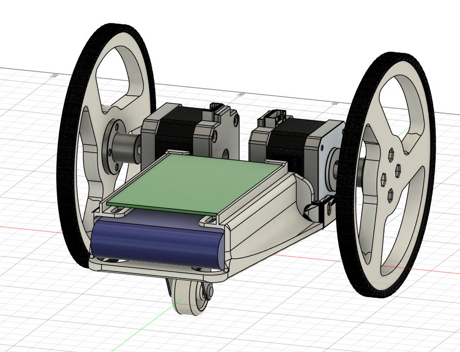
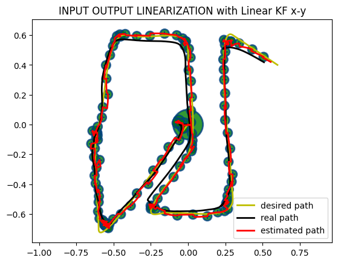
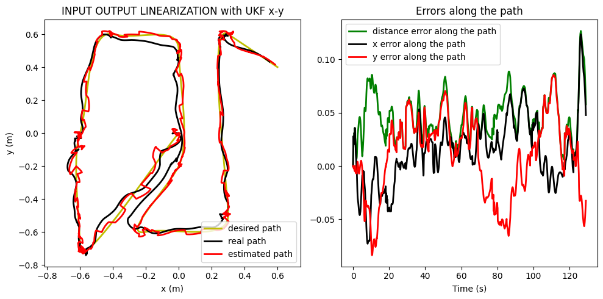
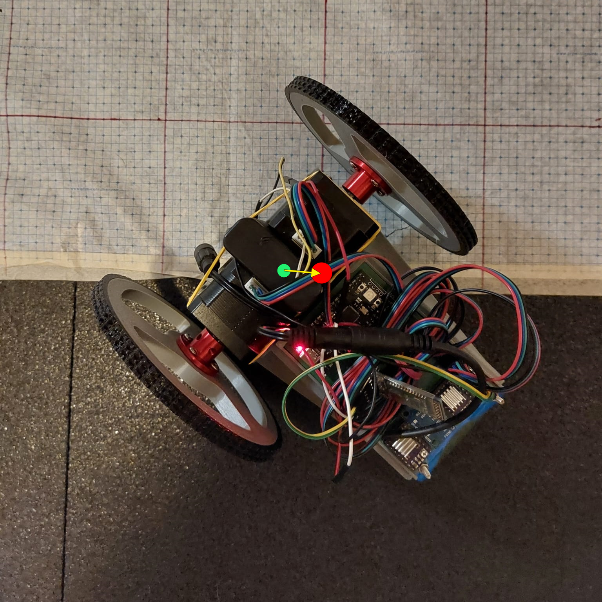
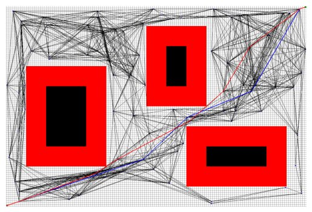
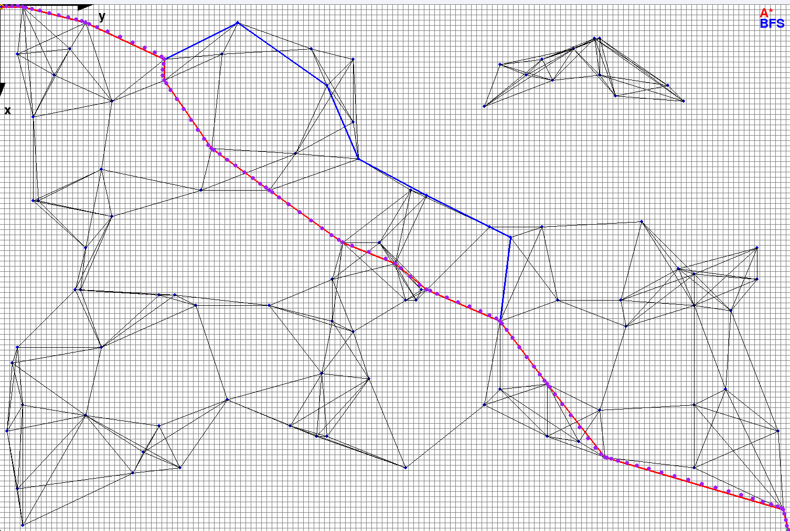
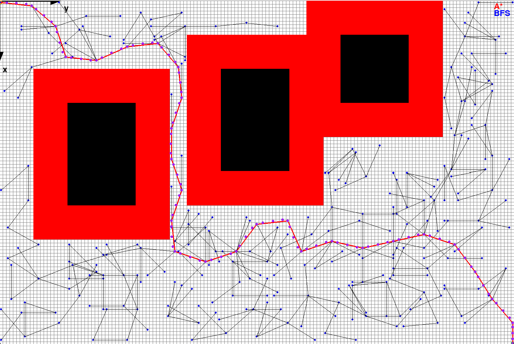

# DRIFTY: Field and Service Robotics Technical Project

## Introduction
The DRIFTY project focuses on advancing the control and motion planning strategies of a differential drive robot. By adopting a unicycle model, the project simplifies the robot's kinematics for easier analysis and control. The main objectives include developing and testing control strategies and motion planning algorithms to navigate environments with obstacles.

	

## Hardware
- **CAD**: The robot design was customized using Autodesk Fusion 360 and 3D printed.
- **Components and PCB**: Utilized Raspberry Pi Pico, HC-05 Bluetooth module, GY-6500 IMU sensor, and stepper motors, all mounted on a custom PCB.

  

## Model

### Unicycle Model:
The differential drive robot is modeled as a unicycle to simplify control. The unicycle model uses linear (v) and angular velocities (ω) to describe movement This abstraction helps streamline the control and planning processes.

### Mapping Differential Drive to Unicycle:
The differential drive robot's kinematic equations are adapted to the unicycle model for simplified control and analysis.

### Digital Twin:
A digital twin was created to simulate and evaluate control strategies. This virtual model helps account for real-world deviations by incorporating error models for linear and angular velocities.

## Estimators
Five estimators were implemented and compared:
- **Euler Approximation**
- **Second-Order Runge-Kutta (RK2)**
- **Fourth-Order Runge-Kutta (RK4)**
- **Linear Kalman Filter**
- **Non-Linear Kalman Filter (Unscented Kalman Filter)**
Simulation results show that Runge-Kutta methods and Kalman filters provide more accurate estimations than Euler and second-order Runge-Kutta methods, with the Non-Linear Kalman Filter offering the best performance for longer and more complex trajectories.

  
  

## Control Strategy

### I/O Linearization:
This method linearizes the system's inputs and outputs to allow the use of linear controllers. Simulations and real-world tests demonstrated its effectiveness, with final position errors within a few centimeters. However, high gains can lead to issues like wheel slippage.

### Posture Regulation:
This strategy involves regulating both the robot's position and orientation using polar coordinates. It ensures smooth convergence to the desired configuration, managing both position and orientation effectively. Simulations and tests showed high accuracy with minimal final errors.
Motion Planning

  

## Navigation

### Gridmap:
The environment is represented as a gridmap, where each cell indicates whether it is free or occupied by obstacles. Obstacles are inflated to prevent collisions, ensuring safety during navigation.

### Motion Planning Algorithms:
- **Navigation Function**: Calculates a cost matrix from the goal point to guide movement towards the target efficiently.
- **Rapidly-exploring Random Trees (RRT)**: Generates a tree of paths to connect the start and goal points while avoiding obstacles. The density of the tree is controlled by the step size parameter (δ).
- **Probabilistic Roadmaps (PRM)**: Samples random points in the free space to build a roadmap for multi-query path planning.

  

### Trajectory Planning
Trajectories were tested in both obstacle-free and obstacle-present environments.

  
  

